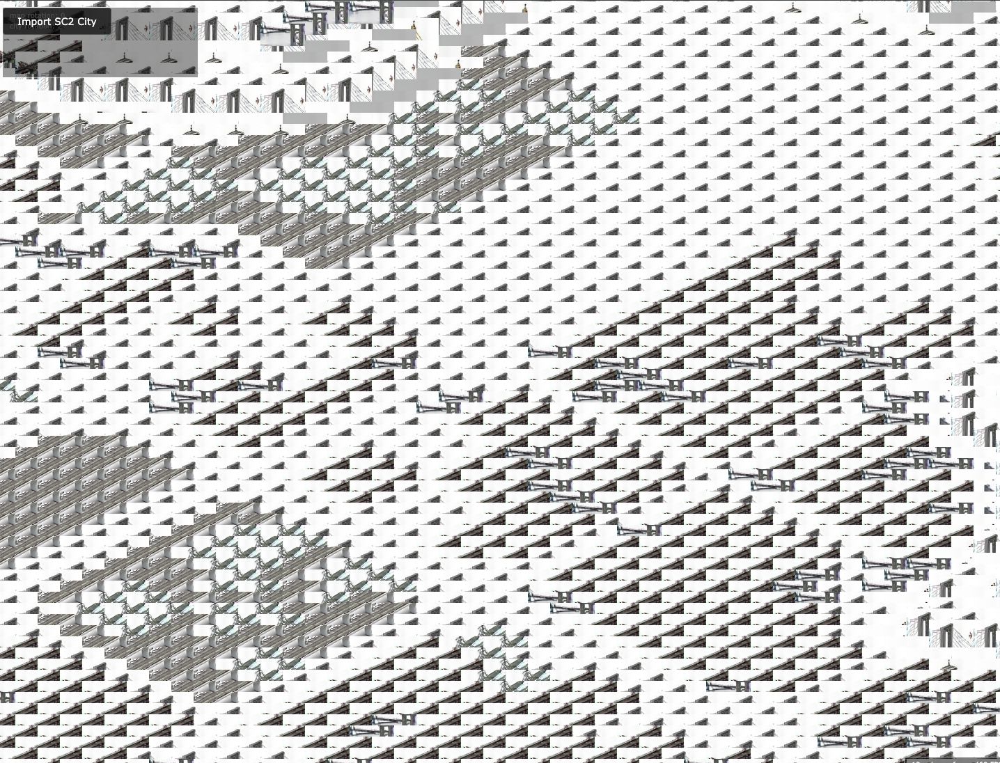

# SC2K City Viewer
SC2K City Viewer - An AI-powered open source city viewer based on OpenSC2K

## Overview
The aim of this project is an open source city viewer for SimCity 2000 that replaces the proprietary game assets with AI-generated ones, making it both functional and fully open source.

Current project state: HIGLY EXPERIMENTAL
Take a look at the screenshot yourself

What was done so far
- Converted the Electron-Version into a pure web version, inklusive sql db.
- Moved the whole project from JavaScript to Typescript
- AI generated descriptions for all original game assets
- AI generated assets based on the image descriptions

Until know the result doesn't resemble a real city yet, because the AI fails to generate a consistent sprite set.
Main components are the python Scripts in this project.

The project is based on OpenSC2K, an attempt to reimplement Sim City 2000 in open source. OpenSC2K development stalled, so it does not have the real simulation yet, only a city viewer. The city viewer from the original implementation only works if the user copies proprietary assets from the game copy into OpenSC2K. Some repos also include the original Sim City 2000 assets which is illegal.

This project aims to replace the original Sim City 2000 assets with AI-generated ones, so it is both functional and fully open source. (fully functional in the sense of city viewing, not in the sense of a full game simulation)

## Asset Generation
The asset generation process works as follows:

1. **Computer Vision**: Image descriptions are generated from the original game assets
2. **AI Generation**: AI-generated images are created from the image descriptions and a styles prompt

## Credits

Based on the work of:
- **OpenSC2K** - An attempt to reimplement SimCity 2000 in open source
  - Credits: The original authors of OpenSC2K

Original game assets were extracted from the original SimCity 2000 Special Edition CD and are NOT covered by the GNU General Public License used by this project. These assets are copyright EA / Maxis.

Using sc2kparser created by Objelisks distributed under the terms of the ISC license.
<https://github.com/Objelisks/sc2kparser>

Based on the work of Dale Floer:
- SimCity 2000 specifications (*.sc2)
- MIF / LARGE.DAT graphics extraction

Based on the work of David Moews:
- SimCity 2000 for MS-DOS file format; unofficial partial information <http://djm.cc/dmoews.html>

## Installation

### OS X
1. `git clone https://github.com/karma-works/sc2k-city-viewer.git` or download this repository
1. `cd sc2k-city-viewer`
1. `npm install` downloads and installs the dependencies
1. `npm run dev` to start the development server

### Windows
1. `git clone https://github.com/karma-works/sc2k-city-viewer.git` or download this repository
1. `cd sc2k-city-viewer`
1. `npm install` downloads and installs the dependencies
1. `npm run dev` to start the development server

### Linux
1. `git clone https://github.com/karma-works/sc2k-city-viewer.git` or download this repository
1. `cd sc2k-city-viewer`
1. `npm install` downloads and installs the dependencies
1. `npm run dev` to start the development server

## Usage
By default, there is no saved city loaded - select a valid SimCity 2000 .sc2 saved game when the file open prompt appears. The city will be imported and saved within the SQLite database and prompt to reload. Right now, the last imported city will automatically load with no option to change cities. To import a new city, press `O` and the file open prompt should appear.

Additional Keys:
 - `O` to open a new .sc2 file for import
 - `Q` or `W` to rotate the camera left or right respectively.
 - `1` sets the current cursor tool to none
 - `2` sets the current cursor tool to "center" (center the map on click)
 - `3` sets the current cursor tool to "info" (displays tile info)
 - `0` clears the database (deletes all cities)
 - Arrow keys to move the camera around

### Debug Overlays
These functions will toggle various debug overlays and views built in to the engine to assist with development. Many of these overlays negatively impact performance significantly.

 - `Z` toggles building key tile display (corners)
 - `C` toggles display of tile coordinates
 - `I` toggles display of a sequence number on each tile in the order of rendering
 - `X` toggles display of terrain layer
 - `V` toggles display of zones layer
 - `Y` toggles display of networks layer (roads, rails, powerlines, highways)
 - `B` toggles display of buildings
 - `N` toggles display of water
 - `M` toggles display of terrain edge blocks
 - `H` toggles display of terrain height map
 - `K` toggles an overlay on top of zones
 - `J` toggles an overlay on top of networks
 - `T` toggles the clip boundary debug view (and sets the clipping box to 200px away from the window border)
 - `F5` to reload the application / re-initialize

## Acknowledgements
Using sc2kparser created by Objelisks distributed under the terms of the ISC license.
<https://github.com/Objelisks/sc2kparser>

Based on the work of Dale Floer
 - SimCity 2000 specifications (*.sc2)
 - MIF / LARGE.DAT graphics extraction

Based on the work of David Moews
 - SimCity 2000 for MS-DOS file format; unofficial partial information <http://djm.cc/dmoews.html>

## License
OpenSC2K - An Open Source SimCity 2000 remake

This program is free software: you can redistribute it and/or modify
it under the terms of the GNU General Public License as published by
the Free Software Foundation, either version 3 of the License, or
(at your option) any later version.

This program is distributed in the hope that it will be useful,
but WITHOUT ANY WARRANTY; without even the implied warranty of
MERCHANTABILITY or FITNESS FOR A PARTICULAR PURPOSE.  See the
GNU General Public License for more details.

You should have received a copy of the GNU General Public License
along with this program.  If not, see <http://www.gnu.org/licenses/>.

Includes assets and graphics extracted from the original SimCity 2000 Special Edition CD. These assets are NOT covered by the GNU General Public License used by this project and are copyright EA / Maxis. I'm including these assets in the hope that because the game has been made freely available at various points in time by EA, and because it's 24 years old as of publishing this project that no action will be taken. Long story short, please don't sue me! Long term, I plan to add functionality to extract assets from the original game files within this project.
